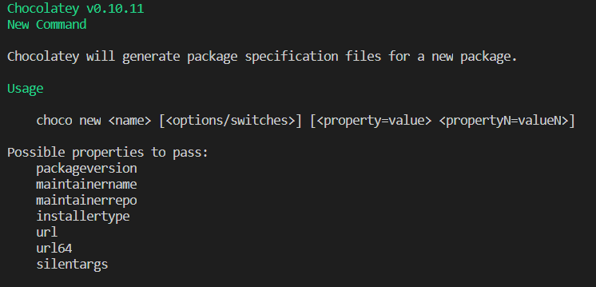
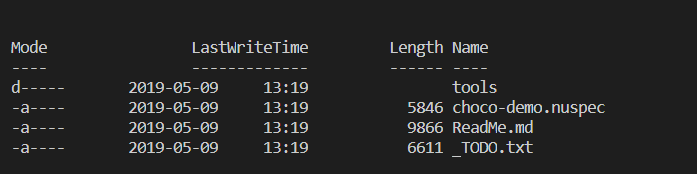
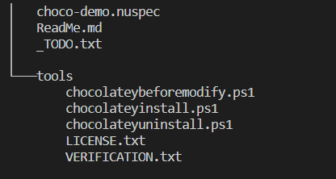

<section data-state="no-title-footer">

# Chocolatey
## no so basic topics

---

### What is Chocolatey?
<blockquote cite="https://chocolatey.org/docs#what-is-chocolatey">
Chocolatey is a software management solution unlike anything else you've ever experienced on Windows. It focuses on simplicity, security, and scalability. You write a software deployment in PowerShell once for any software (not just installers), then you can deploy it ... 
</blockquote>
--
<blockquote cite="https://chocolatey.org/docs#what-is-chocolatey">
... everywhere you have Windows with any solution that can manage systems (configuration management, endpoint management, etc) and track and manage updates of that software over time. Manage software on-premise, in the "Cloud", or in Docker containers with Chocolatey.
</blockquote>
---
# Packaging
--
## Don't package illegal software.
-- 
## Respect the software Licenses.
---

# Before you create a new package
--

| Script Name  | Install    | Upgrade       | Uninstall|
|--------------|-------|---------|----|
| chocolateyBeforeModify.ps1 | No | Yes    | Yes |
| chocolateyInstall.ps1 | Yes | Yes |No|
| chocolateyUninstall.ps1 | No | No | Yes|
--
# Create a new package

```
choco new choco-demo
```


--
# Structure


---
# .nuspec
```
<package xmlns="http://schemas.microsoft.com/packaging/2015/06/nuspec.xsd">
<!-- Section Metadata -->
<metadata>
    <!-- Package information: -->
    <!-- Version, Authors, License, copyright, releaseNotes, etc -->
    <!-- Section Dependencies -->
    <dependencies>
        <!-- Package dependencies and version ranges -->
    </dependencies>
</metadata>
<!-- Section Files -->
<files>
<!-- controls what actually gets packaged into the Chocolatey -->
</files>
</package>
```
--
## Sample .nuspec
```
<?xml version="1.0" encoding="utf-8"?>
<package xmlns="http://schemas.microsoft.com/packaging/2015/06/nuspec.xsd">
  <metadata>
    <id></id>
    <version></version>
    <title></title>
    <authors></authors>
    <description></description>
    <dependencies>
      <dependency id="" version=""/>
    </dependencies>
  </metadata>
  <files>
    <file src="" target="" />
  </files>
</package>
```
-- 

## nuget file struture

* tools directory: Where powershell scripts are located.
* content directory: Where Arbitrary files are located.

-- 
## packaging files
```
<files>
<file src="artifacts\**" target="content/"/>
<file src="tools\**" target="tools" />
<file src="LICENSE.md" target="content/" />
</files>
```
-- 
## Becoming Generic
```
<metadata>
<!-- Begin Replace -->
  <id>$package_id$</id>
  <version>$package_version$</version>
  <title>$package_title$</title>
  <summary>$package_summary$</summary>
  <description>$package_description$</description>
  <!-- End Replace -->
</metadata>
```
--
## Now pack it
```
$> choco pack `
package_id="MyPrecious" `
package_version="1.0.0" `
package_title="My Precious" `
package_summary="My Precious " `
package_description="choco install -y MyPrecious" `
-OutputDirectory ../Artifacts
```
---
# Recomendations
--
* Keep it simple.
* Respect Chocolatey recomendations.
* Keep in mind when the scripts will be triggered.
* You are responsable for cleaning your mess.
* Pack with License, Readme, Installation, Copyright information.

---
## Resources
* https://chocolatey.org/docs/create-packages
* https://chocolatey.org/docs/HelpersReference
* https://docs.microsoft.com/en-us/nuget/create-packages/creating-a-package
