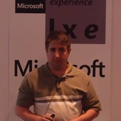

<section data-state="no-title-footer" data-background-image="img/pexels-photo-276452.jpeg"/>

# Code Quality
### AKA
### Keep your WTF racio low
---

# Who I'm I

 

- Software Engineer                              
 
- Community Leader @Netponto                     
 
- Developer Evangelist @Fundisk, @Netponto, ...  
 
- Author @Programar                              
 
- Professional Code Janitor and Mechanic         
 

---

# Agenda

* What is Quality?
* Why we need Code Quality Management?
* When should we do it?
* Who should be doing it?
---

# What is Quality?

--

ISO 8402-1986 standard defines quality as "the totality of features and characteristics of a product or service that bears its ability to satisfy stated or implied needs."

http://www.businessdictionary.com/definition/quality.html

---

# Why we need Code Quality Management?

--

## Control the evolution of the code
## Identify, asap, code bugs, bad practices, etc.

---

# When should we do it?

--

## Soon as possible is even better

---

# Who should be doing it?

--

## Everyone

---

# How to do it?

---

<section data-state="no-title-footer" data-background-image="img/sonarqube-inicial.png"/>

---

<section data-state="no-title-footer" data-background-image="img/maxresdefault.jpg"  style="color:black;font-weight: bold;" />

* codecracker.CSharp
* Microsoft.CodeQuality.Analyzers
* Microsoft.NetCore.Analyzers
* Microsoft.NetFramework.Analyzers
* SonarAnalyzer.CSharp
* StyleCop.Analyzers
* xunit.analyzers

---
# Q & A
---
#Contacts
--

* nuno.cancelo@gmail.com 
* https://www.linkedin.com/in/nunocancelo 
* @masterzdran 
* http://lmgtfy.com/?q=nuno+cancelo 

