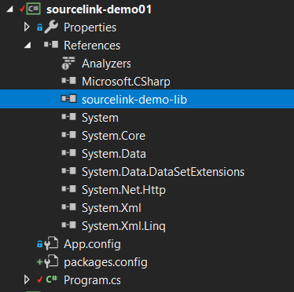
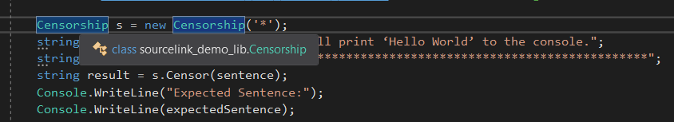
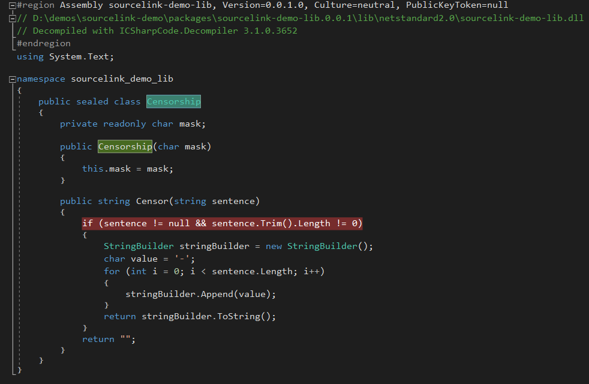
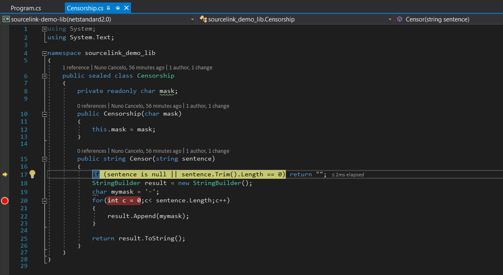

<section data-state="no-title-footer">

# Sourcelink
## Demo 

---

## Sourcelink
<blockquote cite="https://github.com/dotnet/sourcelink">
    Source Link is a language- and source-control agnostic system for providing first-class source debugging experiences for binaries. The goal of the project is to enable anyone building NuGet libraries to provide source debugging for their users with almost no effort. Microsoft libraries, such as .NET Core and Roslyn have enabled Source Link. Source Link is supported by Microsoft.
</blockquote>
---
## Works on Visual Studio
<blockquote cite="https://github.com/dotnet/sourcelink">
Visual Studio 15.3+ supports reading Source Link information from symbols while debugging. It downloads and displays the appropriate commit-specific source for users, such as from raw.githubusercontent, enabling breakpoints and all other sources debugging experience on arbitrary NuGet dependencies. Visual Studio 15.7+ supports downloading source files from private GitHub and Azure DevOps (former VSTS) repositories that require authentication.
</blockquote>

--- 

## Using Sourcelink
--

```
<Project Sdk="Microsoft.NET.Sdk" ToolsVersion="15.0">
  <PropertyGroup>
      <OutputType>Library</OutputType>
      <TargetFrameworks>netstandard2.0;net472</TargetFrameworks>
      <RootNamespace>sourcelink_demo_lib</RootNamespace>
      <CopyLocalLockFileAssemblies>true</CopyLocalLockFileAssemblies>
      <Version>0.0.1</Version>
      <Configurations>Debug;Release;PlatformDebug</Configurations>

      <!-- Optional: Publish the repository URL in the built -->
      <!-- .nupkg (in the NuSpec <Repository> element) -->
      <PublishRepositoryUrl>true</PublishRepositoryUrl>  
     
```

--
```
        <!-- Optional: Embed source files that are not tracked -->
        <!-- by the source control manager in the PDB -->
        <EmbedUntrackedSources>true</EmbedUntrackedSources>

        <!-- Optional: Build symbol package (.snupkg) to distribute -->
        <!-- the PDB containing Source Link -->
        <IncludeSymbols>true</IncludeSymbols>
        <SymbolPackageFormat>snupkg</SymbolPackageFormat>        
    </PropertyGroup>
```
--
```
    <ItemGroup>
      <PackageReference Include="Microsoft.SourceLink.GitLab" 
            Version="1.0.0-beta2-18618-05">
        <PrivateAssets>all</PrivateAssets>
        <IncludeAssets>runtime; build; native; contentfiles; 
              analyzers</IncludeAssets>
      </PackageReference>
    </ItemGroup>
</Project>
```
---

# Demo

--

### sourcelink-demo-lib
```
public sealed class Censorship
{
  private readonly char mask;
  public Censorship(char mask){ this.mask = mask;}
  public string Censor(string sentence)
  {
      if (sentence is null || sentence.Trim().Length == 0) 
        return "";
      StringBuilder result = new StringBuilder();
      for(int c = 0;c< sentence.Length;c++)
      {
          result.Append('-');
      }
      return result.ToString();
  }
}
```

-- 

### sourcelink-demo01
<pre><code class="cs">
internal sealed class Program
{
  private Program(){}
  static void Main(string[] args)
  {
    Censorship s = new Censorship('*');
    string sentence = "The code provided will print.";
    string eSentence = "---------------------------";
    string result = s.Censor(sentence);
    Console.WriteLine("Expected Sentence:");
    Console.WriteLine(eSentence);
    Console.WriteLine("Result:"); Console.WriteLine(result);
    Console.ReadKey();
  }
}
</code></pre>

--


--


--


--


---
## Resources

* https://github.com/dotnet/sourcelink
* https://github.com/ctaggart/SourceLink
* https://www.hanselman.com/blog/ExploringNETCoresSourceLinkSteppingIntoTheSourceCodeOfNuGetPackagesYouDontOwn.aspx